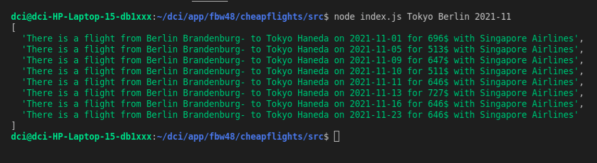

# cheapflights

my first back-end application which can inform you about the flight prices made by using the API from scyscanner

## Getting Started

To get a local copy up and running follow these simple steps.

### Prerequisites

You need to make sure you machine has NPM installed and up to date.

- npm
  ```sh
  npm install
  ```

### Installation

1. Clone the repo
   ```sh
   git clone <githublink> <your directory name>
   ```
2. Move in the cloned repository
   ```sh
   cd <your directory name>
   ```
3. Download NPM packages

npm i express
npm i dotenv
npm i axios --save

4. Run the application
   write in terminal:

sh node index.js <departurecity> <destinationcity> <date>


- the parametres are case sensitive and the date must follow the format YYYY-MM
  for example node index.js Tokyo Berlin 2021-11
  <a href="https://github.com/github_username/repo_name">
  
  </a>
